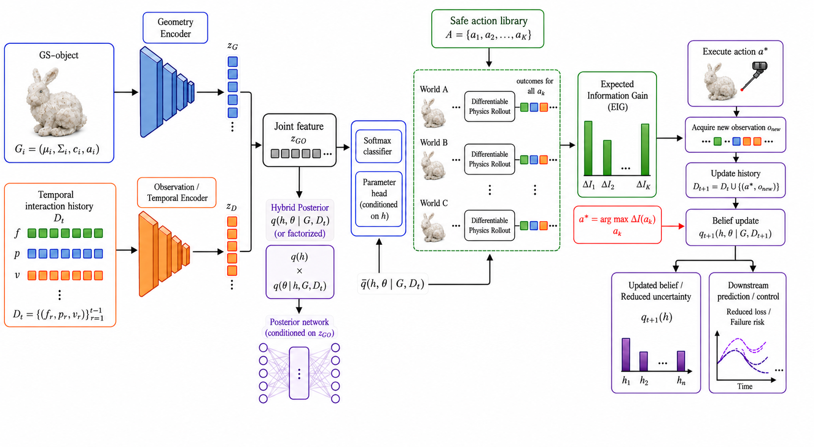
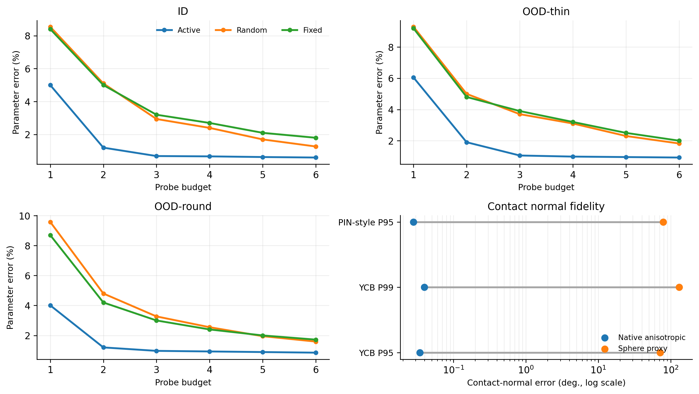
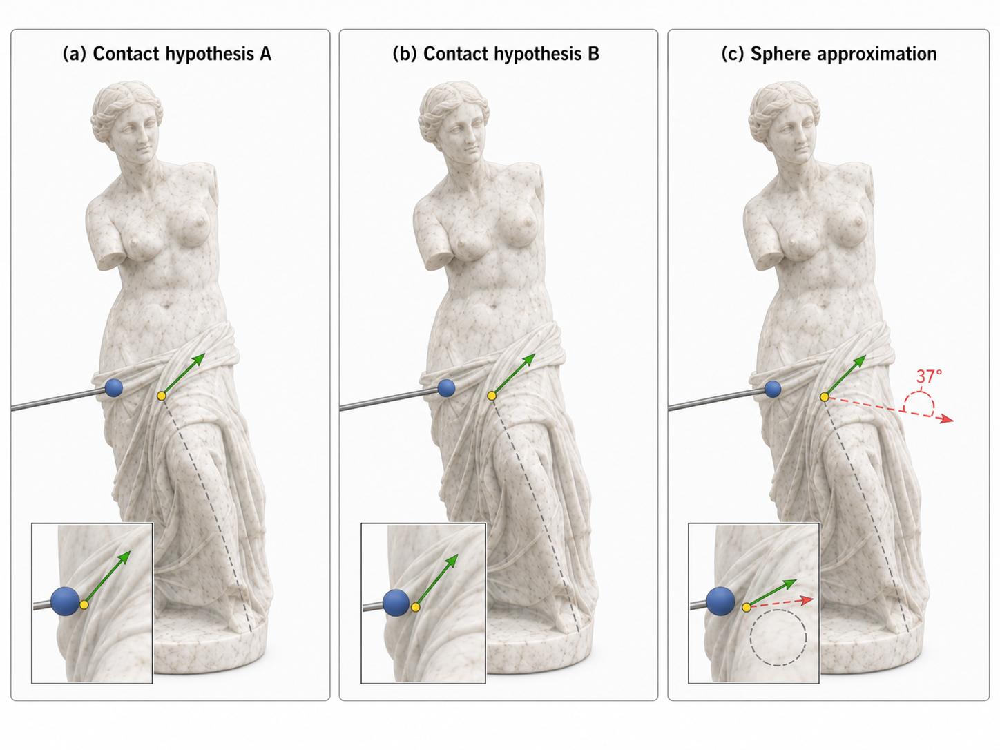
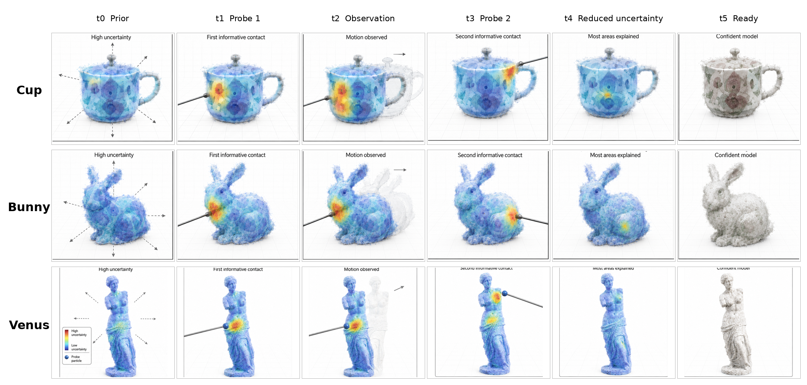
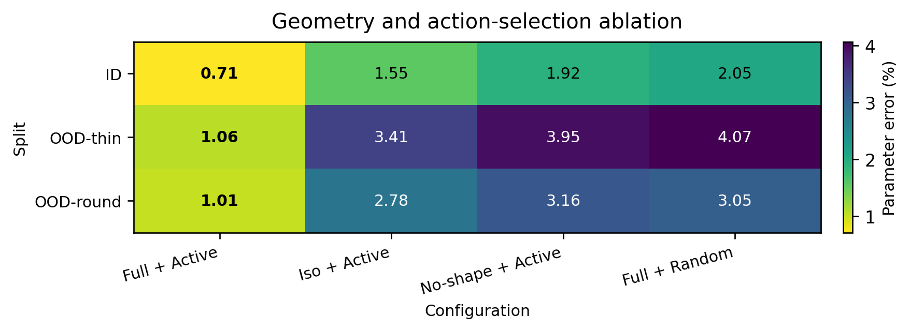

# ActiveContactGS 开源代码

[](https://github.com/lyylovemwj/ActiveContactGS/actions/workflows/ci.yml)
[](LICENSE)

这是论文 **Contact Geometry Is a Latent Variable: Active Bayesian Identification of Gaussian Physical Worlds** 的轻量开源仓库。

<p align="center">
  
</p>

本目录只包含：

- 方法、训练、评测、统计与绘图源码；
- 2 项 CPU smoke test 和 26 项 CUDA 测试；
- 三种子、消融、视频观测、YCB 和 PIN-WM 的复现脚本与说明；
- Python/Conda 环境配置；
- GitHub CI、Issue/PR 模板；
- MIT License、引用文件和第三方资产说明；
- 5 张从论文 PDF 无损提取的方法、结果和定性图。

本目录不包含 checkpoint、生成数据、原始实验 JSON 或运行日志。

## 快速开始

```bash
python -m venv .venv
python -m pip install -e ".[analysis,assets,dev]"
python -c "import torch, active_contact_gs; print(torch.__version__)"
python -m pytest -q
```

安装完成后，在 CUDA 机器上运行跨平台快速示例：

```bash
python scripts/quickstart.py
```

它会在 `outputs/quickstart/` 生成一次小规模 Active/Random/Fixed 对比及分析 JSON，仅用于验证流程，不是论文正式结果。详细说明见 [Quick Start](docs/QUICKSTART.md)。

## 结果预览



| 各向异性接触几何 | 跨物体主动探测过程 |
|---|---|
|  |  |

<details>
<summary><strong>展开论文 Figure 4：几何与动作选择消融</strong></summary>



</details>

完整训练与正式评测命令见 [复现说明](docs/REPRODUCIBILITY.md)。图片来源映射见 [assets/images/README.md](assets/images/README.md)。引用信息见 [CITATION.cff](CITATION.cff)；论文正式发表后请一并引用。
